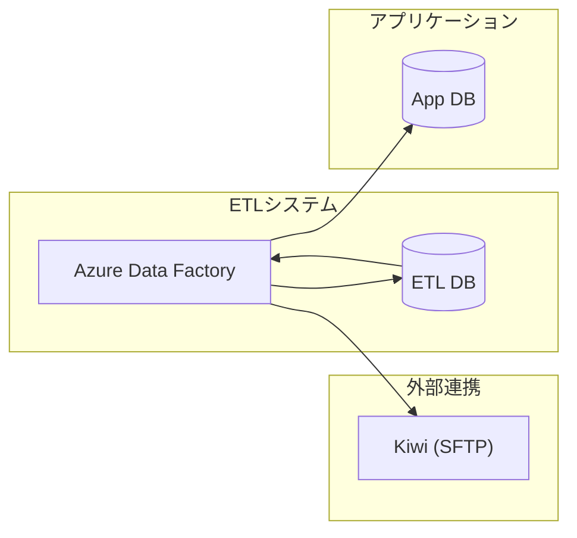
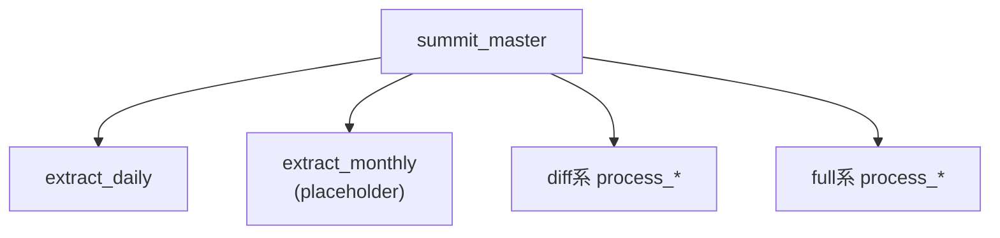
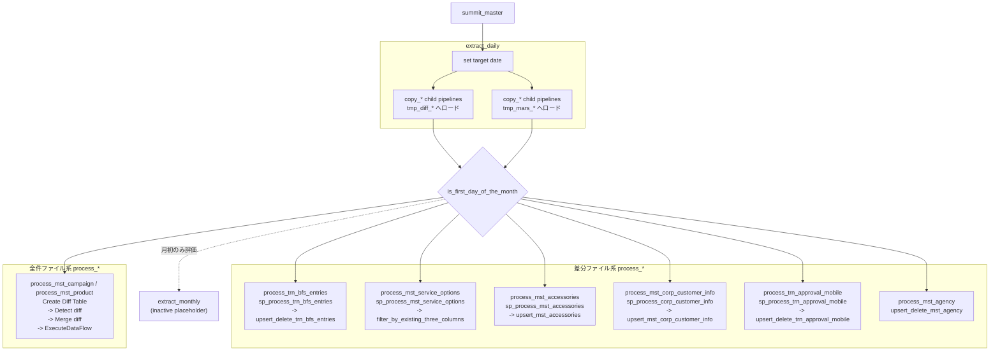

# ETLアーキテクチャ

シークエンス図は [sequence.md](./sequence.md) を参照。

## 対象スコープ

- `b_hjn_bfs_mobile_entry` -> `tmp_diff_bfs_entry_informations`
- `b_hjn_bfs_mobile_service_summary_device` -> `tmp_diff_bfs_service_summary_devices`
- `b_hjn_bfs_mobile_service_summary_accessory` -> `tmp_diff_bfs_service_summary_accessories`
- `m_hjn_smt_unified_company` -> `tmp_diff_corp_customer_info`
- `b_hjn_com_sales_approval` -> `tmp_diff_compass_sales_approval`
- `m_agency_all` -> `tmp_diff_mars_agency`
- `m_campaign` -> `tmp_mars_campaign`
- `m_product_all` -> `tmp_mars_product`

## システム全体

## パイプライン構成

## process パイプライン詳細

- `process_mst_campaign` と `process_mst_product` は ADF 上の手順がほぼ同型のため、1 ノードにまとめている
- `process_mst_agency` は Script を挟まず、Data Flow のみで `mst_agency` に反映
- そのほかの差分ファイル系 `process_*` は、Script で ETL DB 側の加工を行ってから Data Flow で App DB に反映

## 基本方針

- 旧 `pl_bfs_compass_etl` を廃止し、目的ごとにパイプラインを分割する
- `summit_master` が抽出と後続処理をオーケストレーションする
- `extract_daily` は `targetDate` を決めて 8 本の `copy_*` 子パイプラインを並列起動する
- `extract_monthly` は将来用の placeholder として残す
- 差分ファイルは `tmp_diff_*` に、全件ファイルは `tmp_mars_*` に取り込む
- 取込先テーブルの作成・初期化は `sp_init_tmp_*` に寄せ、DDL を git 管理する
- `extract_daily.json` 内の旧 `extractSources` ForEach は残っているが `Inactive`
- 差分ファイルは `tmp_diff_*` を直接後続処理に渡す
- 全件ファイルは `tmp_base_*` / `tmp_diff_*` を使って差分判定してから App DB に反映する
- `sp_detect_diff` は比較対象カラム未指定時、主キー以外の全カラムを差分判定対象にできる

## マート別の受信方式

| 区分 | マート |
|---|---|
| 全件 | `m_campaign`, `m_product_all` |
| 差分 | `b_hjn_bfs_mobile_entry`, `b_hjn_bfs_mobile_service_summary_device`, `b_hjn_bfs_mobile_service_summary_accessory`, `m_hjn_smt_unified_company`, `b_hjn_com_sales_approval`, `m_agency_all` |

## ETL DB 上の役割

| 役割 | テーブル |
|---|---|
| 差分ファイル取込先 | `tmp_diff_*` |
| 全件ファイル取込先 | `tmp_mars_*` |
| 全件比較用ベース | `tmp_base_*` |
| 全件比較結果 | `tmp_diff_*` |
| App DB 反映用中間出力 | `sp_output_*` |

## App DB反映先

既存の process パイプラインから確認できる反映先は以下。

| 取り込み元 | App DB反映先 |
|---|---|
| `b_hjn_bfs_mobile_entry` | `trn_bfs_entries` |
| `b_hjn_bfs_mobile_service_summary_device` | `trn_bfs_entries`, `mst_service_options` |
| `b_hjn_bfs_mobile_service_summary_accessory` | `trn_bfs_entries`, `mst_accessories` |
| `m_hjn_smt_unified_company` | `mst_corp_customer_info` |
| `b_hjn_com_sales_approval` | `trn_approval_mobile` |
| `m_agency_all` | `mst_agency` |

## 実行順序

1. `summit_master` が `extract_daily` を実行する
2. 毎月 1 日のみ `extract_monthly` を評価する
3. `process_trn_bfs_entries`
4. `process_mst_service_options`
5. `process_mst_accessories`
6. `process_mst_corp_customer_info`
7. `process_trn_approval_mobile`
8. `process_mst_agency`
9. `process_mst_campaign`
10. `process_mst_product`

`process_*` は monthly 判定完了後に並列で実行する構成。
