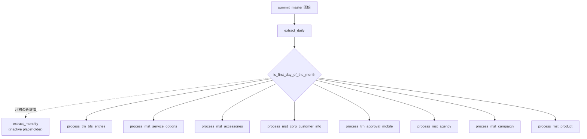

# `summit_master`

## 役割

`summit_master` は ETL 全体の親パイプライン。  
`extract_daily` 実行後に月初判定を行い、後続の `process_*` パイプラインを起動。

## 起動する子パイプライン

| パイプライン | 役割 | 参照先 |
|---|---|---|
| `extract_daily` | SFTP から日次ファイルを取得し、`tmp_diff_*` / `tmp_mars_*` にロード。 | [extract_daily.md](./extract_daily.md) |
| `extract_monthly` | 月初だけ評価する placeholder。 |  |
| `process_trn_bfs_entries` | BFS エントリ系 3 テーブルから `trn_bfs_entries` を作成。 | [sp_process_trn_bfs_entries.md](../stored_procedures/sp_process_trn_bfs_entries.md) |
| `process_mst_service_options` | 端末サマリから `mst_service_options` を作成。 | [sp_process_mst_service_options.md](../stored_procedures/sp_process_mst_service_options.md) |
| `process_mst_accessories` | 付属品サマリから `mst_accessories` を作成。 | [sp_process_mst_accessories.md](../stored_procedures/sp_process_mst_accessories.md) |
| `process_mst_corp_customer_info` | 顧客 CSV と BFS エントリから `mst_corp_customer_info` を作成。 | [sp_process_corp_customer_info.md](../stored_procedures/sp_process_corp_customer_info.md) |
| `process_trn_approval_mobile` | COMPASS 決裁差分から `trn_approval_mobile` を作成。 | [sp_process_trn_approval_mobile.md](../stored_procedures/sp_process_trn_approval_mobile.md) |
| `process_mst_agency` | Mars 取次店データを App DB に反映。 | 専用の stored procedure ドキュメントなし |
| `process_mst_campaign` | Campaign 全件を比較し、差分のみ App DB に反映。 | 共通処理として `sp_detect_diff()` / `sp_merge_to_base()` を使用 |
| `process_mst_product` | Product 全件を比較し、差分のみ App DB に反映。 | 共通処理として `sp_detect_diff()` / `sp_merge_to_base()` を使用 |

## 処理フローチャート

## 補足

- `extract_monthly` は ADF テンプレート上では `Inactive`。現状は placeholder 扱い。
- 各 `process_*` は `is_first_day_of_the_month` の `Completed` 後に起動。月初判定の真偽にかかわらず後続処理へ進む。
- 実行順の起点は `extract_daily`。

## 参照実装

- [`summit_master.json`](../../../etl/adf/azure_data_factory_template/summit_master/summit_master.json)
