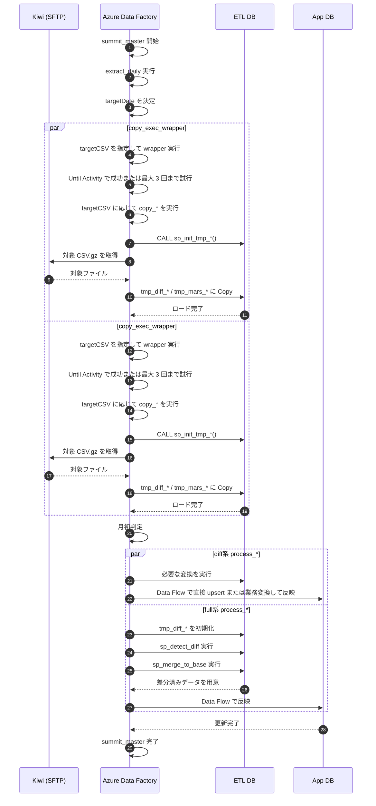
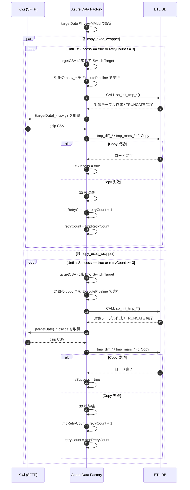
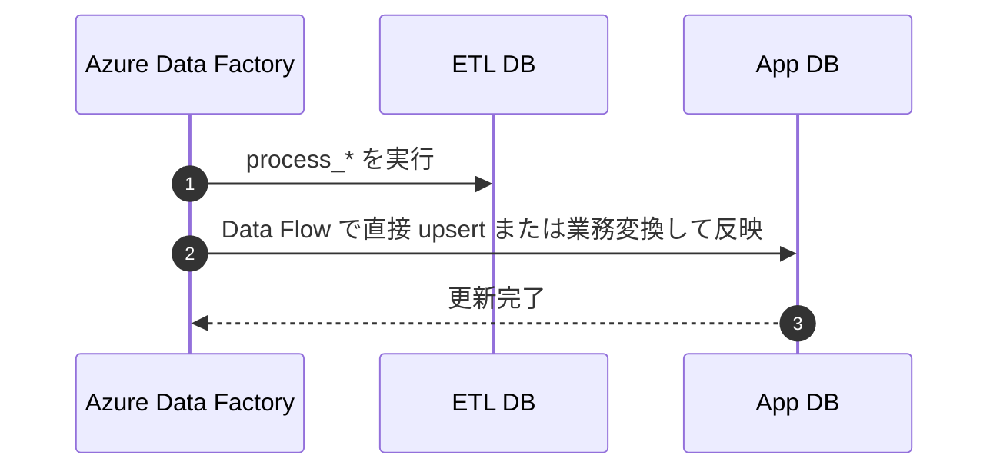
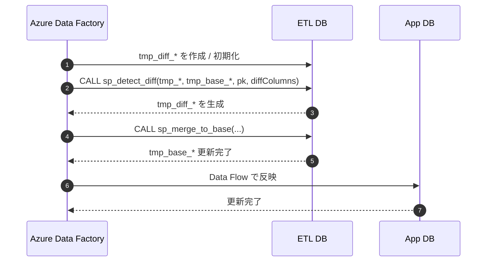

# ETLシーケンス図

## 概要

ETL 内での Kiwi (SFTP) / ADF / ETL DB / App DB 間の主要なやり取りを示す。

関連する全体構成図は [architecture.md](./architecture.md) を参照。

## 全体シーケンス

## 日次抽出

`extract_daily` は `testTargetDate` か `TriggerTime` から `targetDate` を決め、8 対象分の `copy_exec_wrapper` を並列に実行する。`copy_exec_wrapper` は `targetCSV` に応じて対象の `copy_*` パイプラインを呼び出し、Activity 単位のリトライではなく Until Activity 内で初期化から Copy までをまとめて最大 3 回試行する。

## 差分ファイルの後続処理

差分ファイルは ETL 側で追加の差分検知を行わず、そのまま業務変換と App DB 反映に進む。  
対象:

- `b_hjn_bfs_mobile_entry`
- `b_hjn_bfs_mobile_service_summary_device`
- `b_hjn_bfs_mobile_service_summary_accessory`
- `m_hjn_smt_unified_company`
- `b_hjn_com_sales_approval`
- `m_agency_all`

## 全件ファイルの後続処理

全件ファイルは ETL DB 内で比較して差分化してから App DB に反映。  
対象:

- `m_campaign`
- `m_product_all`

## 補足

- `sp_detect_diff` は `diffColumns` を空文字で渡した場合、主キー以外の全カラムを比較対象にできる
- `extract_monthly` は現状 placeholder のため、`summit_master` では月初のみ評価される
