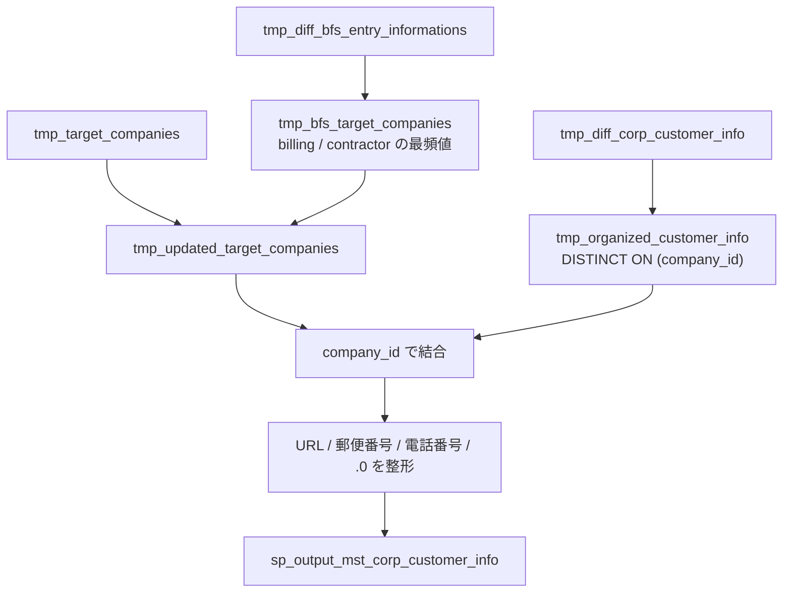

# `sp_process_corp_customer_info()`

## 目的

`tmp_target_companies` を基準に、BFS エントリ差分から請求先番号・契約者番号の代表値を取得して反映し、顧客 CSV の法人属性を結合して `mst_corp_customer_info` 用のデータを組み立てる。

## 入力

| テーブル | 役割 |
|---|---|
| `tmp_diff_corp_customer_info` | 顧客マスタ系の元データ |
| `tmp_diff_bfs_entry_informations` | 企業ごとの請求先番号 / 契約者番号の補強元 |
| `tmp_target_companies` | 対象企業の基準テーブル |

## 一時テーブル / 出力

| テーブル | 役割 |
|---|---|
| `tmp_organized_customer_info` | `company_id` ごとの代表顧客行 |
| `tmp_bfs_target_companies` | BFS 由来の請求先番号 / 契約者番号の最頻値 |
| `tmp_updated_target_companies` | `tmp_target_companies` に BFS 情報を反映した結果 |
| `sp_output_mst_corp_customer_info` | 整形済みの出力 |

## データフロー図

## 主要変換ルール

| 段階 | 内容 |
|---|---|
| `tmp_organized_customer_info` | `tmp_diff_corp_customer_info` から `company_id` ごとに代表行を 1 行選ぶ |
| ドメイン抽出 | `company_url` からプロトコルと `www.` を除去して `domain_name` を作成 |
| `tmp_bfs_target_companies` | `unified_company_code` ごとに `billing_number` / `contractor_number` の最頻値を求める |
| `tmp_updated_target_companies` | `tmp_target_companies` に BFS 側の値を上書きし、`123.0` のような末尾 `.0` を除去する |
| 最終整形 | 郵便番号と電話番号のハイフン除去、桁上限に合わせた `LEFT()`、各種 `COALESCE()` |

## 関連実装

- [`sp_process_corp_customer_info_ddl.sql`](../../../etl/adf/stored_procedure/sp_process_corp_customer_info_ddl.sql)
- [`process_mst_corp_customer_info.json`](../../../etl/adf/azure_data_factory_template/process_mst_corp_customer_info/process_mst_corp_customer_info.json)
