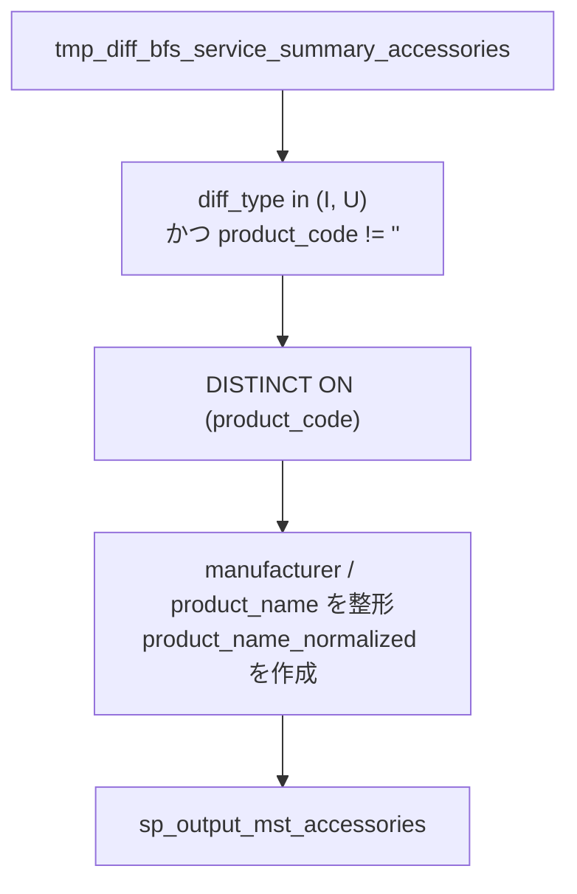

# `sp_process_mst_accessories()`

## 目的

付属品差分データから `mst_accessories` 用の候補を作成。

## 入力

| テーブル | 役割 |
|---|---|
| `tmp_diff_bfs_service_summary_accessories` | 付属品マスタの元データ |

## 出力

| テーブル | 役割 |
|---|---|
| `sp_output_mst_accessories` | 正規化済みの出力 |

## データフロー図

## 主要変換ルール

| 出力列 / 段階 | ルール |
|---|---|
| 抽出対象 | `diff_type in ('I', 'U')` のみ |
| 主キー候補 | `product_code` が空の行は除外 |
| 重複排除 | `DISTINCT ON (product_code)` |
| `manufacturer`, `product_name` | `LEFT(..., 255)` で切り詰め |
| `product_name_normalized` | NFKC、trim、連続空白圧縮、`ー -> -`、小文字化 |

## 関連実装

- [`sp_process_mst_accessories_ddl.sql`](../../../etl/adf/stored_procedure/sp_process_mst_accessories_ddl.sql)
- [`process_mst_accessories.json`](../../../etl/adf/azure_data_factory_template/process_mst_accessories/process_mst_accessories.json)
