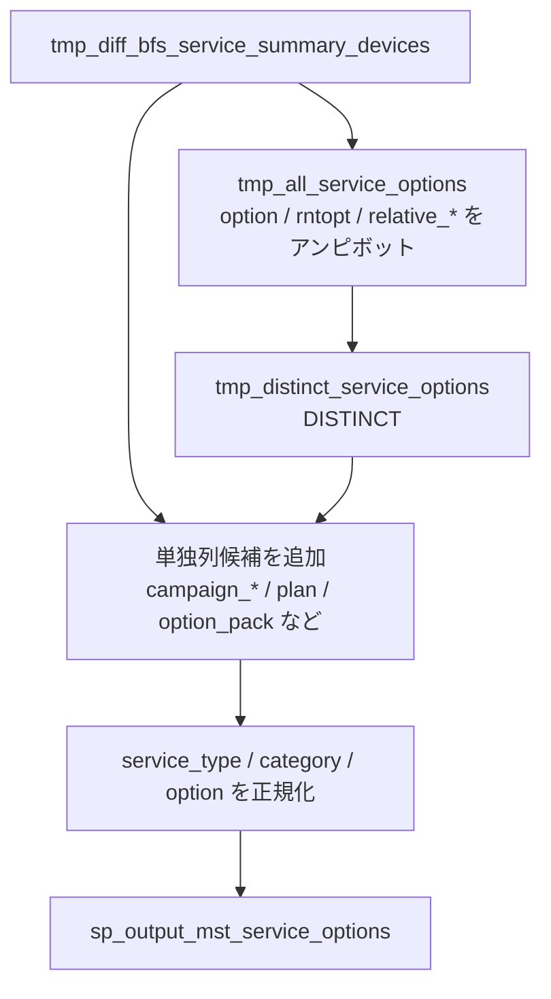

# `sp_process_mst_service_options()`

## 目的

端末サマリの複数列をアンピボットして、`mst_service_options` 用の候補集合を作成。

## 入力

| テーブル | 役割 |
|---|---|
| `tmp_diff_bfs_service_summary_devices` | オプション、レンタルオプション、相対プロダクト、単独列の元データ |

## 一時テーブル / 出力

| テーブル | 役割 |
|---|---|
| `tmp_all_service_options` | 複数列をアンピボットした生の候補集合 |
| `tmp_distinct_service_options` | 重複排除した候補集合 |
| `sp_output_mst_service_options` | 正規化済みの出力 |

## データフロー図

## 主要変換ルール

| 段階 | 内容 |
|---|---|
| アンピボット 1 | `option_category_1-10` と `option_service_1-10` を `service_type='オプション'` で展開 |
| アンピボット 2 | `rntopt_category_1-10` と `rntopt_plan_1-10` を `service_type='レンタルオプション'` で展開 |
| アンピボット 3 | `relative_pd_category_1-10` と `relative_pd_name_1-10` を `service_type='相対プロダクト'` で展開 |
| アンピボット 4 | `relative_other_pd_category_1-5` と `relative_other_pd_name_1-5` を `service_type='相対その他プロダクト'` で展開 |
| 単一カラムの個別値を処理 | `campaign_*`, `plan`, `call_discount_w_white`, `option_pack` などを対象に追加 |
| service_type の決定 | 既に収集済みのサービス種別データ内に `(category, option)` の組み合わせとして存在する場合、その `service_type` で追加 |
| 正規化 | `category` / `option` に NFKC、trim、連続空白圧縮、`ー -> -`、小文字化を適用 |

## 関連実装

- [`sp_process_mst_service_options_ddl.sql`](../../../etl/adf/stored_procedure/sp_process_mst_service_options_ddl.sql)
- [`process_mst_service_options.json`](../../../etl/adf/azure_data_factory_template/process_mst_service_options/process_mst_service_options.json)
