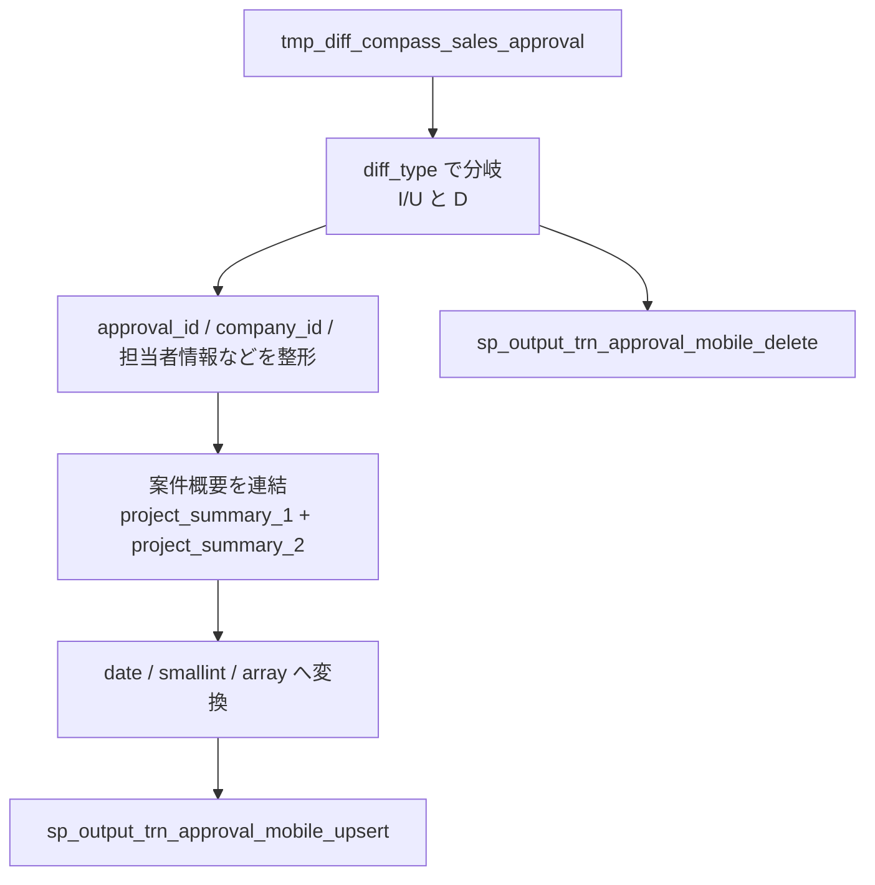

# `sp_process_trn_approval_mobile()`

## 目的

COMPASS 決裁差分から `trn_approval_mobile` 用の upsert / delete 出力を作成。

## 入力

| テーブル | 役割 |
|---|---|
| `tmp_diff_compass_sales_approval` | 決裁差分の元データ |

## 出力

| テーブル | 役割 |
|---|---|
| `sp_output_trn_approval_mobile_upsert` | `I/U` 用の出力 |
| `sp_output_trn_approval_mobile_delete` | `D` 用の出力 |

## データフロー図

## 主要変換ルール

| 出力列 / 段階 | ルール |
|---|---|
| `approval_id` | `LEFT(..., 10)` |
| `company_id` | `LEFT(..., 10)` |
| `company_name` | `LEFT(..., 100)` |
| `operation_type` | `proposal_type` を `LEFT(..., 18)` で整形 |
| `name_pic` | `contact_name` を `LEFT(..., 100)` で整形 |
| `phone_number_pic` | `contact_person_phone_number` から `-` を除去して `LEFT(..., 11)` |
| `case_title` | `project_name` |
| `case_description` | `project_summary_1` + `project_summary_2` |
| `expected_contract_start_date` | `contract_start_date::date` |
| `contract_period` | `contract_period_months::smallint` |
| `auto_extension_flg` | `automatic_renewal` を `LEFT(..., 2)` で整形 |
| `related_approval_ids` | `compass_related_approval` を `string_to_array(..., ',')` で分割 |
| 削除出力 | `diff_type = 'D'` の `approval_id` を `sp_output_trn_approval_mobile_delete` へ出力する |

## 関連実装

- [`sp_process_trn_approval_mobile_ddl.sql`](../../../etl/adf/stored_procedure/sp_process_trn_approval_mobile_ddl.sql)
- [`process_trn_approval_mobile.json`](../../../etl/adf/azure_data_factory_template/process_trn_approval_mobile/process_trn_approval_mobile.json)
