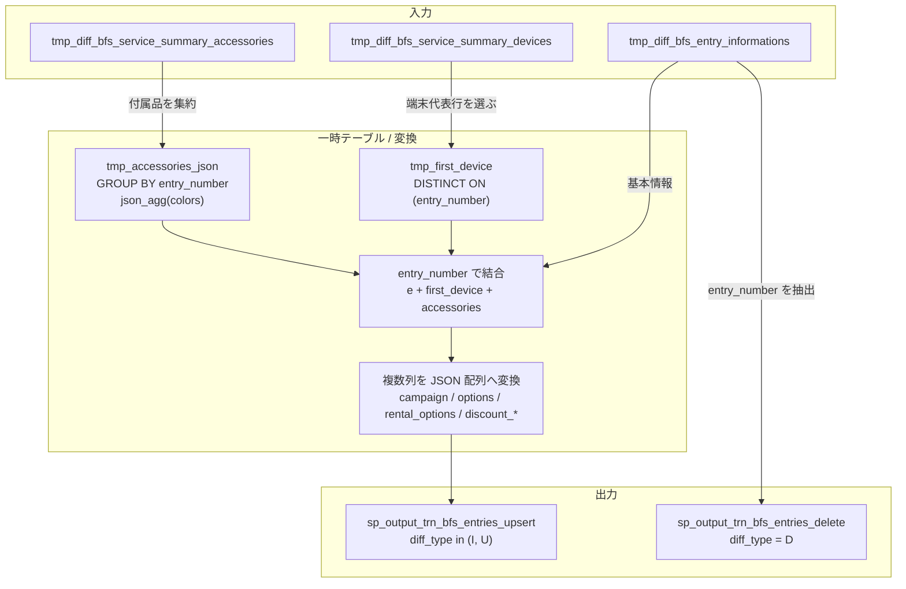

# `sp_process_trn_bfs_entries()`

## 目的

BFS 系 3 テーブルの差分データを `entry_number` で突合し、`trn_bfs_entries` 向けのレコードを作成

## 入力

| テーブル | 役割 |
|---|---|
| `tmp_diff_bfs_entry_informations` | エントリ本体。削除判定の基準にも使う |
| `tmp_diff_bfs_service_summary_devices` | 端末側の代表行と、キャンペーン / オプション / 割引情報の元データ |
| `tmp_diff_bfs_service_summary_accessories` | 付属品一覧の元データ |

## 一時テーブル / 出力

| テーブル | 役割 |
|---|---|
| `tmp_first_device` | `entry_number` ごとの代表端末行 |
| `tmp_accessories_json` | 付属品を JSON 配列へ集約した結果 |
| `sp_output_trn_bfs_entries_upsert` | `I/U` 用の出力 |
| `sp_output_trn_bfs_entries_delete` | `D` 用の出力 |

## データフロー図

## 主要変換ルール

| 出力列 / 段階 | 元データ | ルール |
|---|---|---|
| `bfs_entry_id` | `e.entry_number` | そのまま主キーとして使う |
| `approval_id` | `e.approval_number_1` | 先頭の決裁番号のみ使う |
| `company_id` | `e.unified_company_code` | エントリ本体から採用 |
| `agency_code_1` | `e.agency_code_1` | `LEFT(..., 54)` で整形 |
| `agency_name` | `e.agency_name` | `LEFT(..., 2295)` で整形 |
| `tmp_first_device` | `tmp_diff_bfs_service_summary_devices` | `DISTINCT ON (entry_number)` で代表端末行を 1 行選ぶ |
| `tmp_accessories_json` | `tmp_diff_bfs_service_summary_accessories` | `entry_number` 単位に `json_agg()`。各付属品の中で色と数量も配列化する |
| `campaign` | `campaign_1` - `campaign_5` | 空でない値だけを JSON 配列化 |
| `options` | `option_category_*` + `option_service_*` | `{category, service}` の JSON 配列を作成 |
| `rental_options` | `rntopt_category_*` + `rntopt_plan_*` | `{category, service}` の JSON 配列を作成 |
| `discount_devices` | `relative_pd_category_*` + `relative_pd_name_*` | `{category, name}` の JSON 配列を作成 |
| `discount_services` | `relative_other_pd_category_*` + `relative_other_pd_name_*` | `{category, name}` の JSON 配列を作成 |
| `sp_output_trn_bfs_entries_delete` | `tmp_diff_bfs_entry_informations` | `diff_type = 'D'` の `entry_number` を削除用に出力する |

## 関連実装

- [`sp_process_trn_bfs_entries_ddl.sql`](../../../etl/adf/stored_procedure/sp_process_trn_bfs_entries_ddl.sql)
- [`process_trn_bfs_entries.json`](../../../etl/adf/azure_data_factory_template/process_trn_bfs_entries/process_trn_bfs_entries.json)
